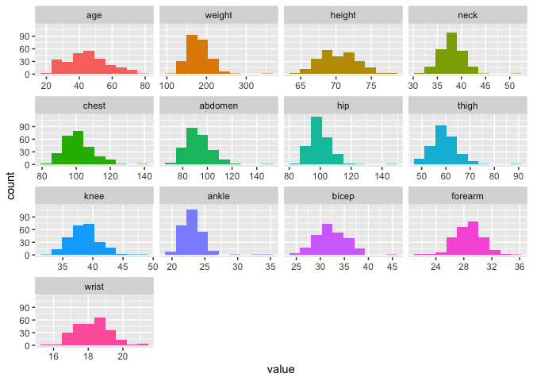

data
================
2022-12-14

``` r
body_df=read_excel("data/body_density_data.xlsx") %>%
  janitor::clean_names() %>%
  select(-bodyfat_brozek,-body_density,-id)
```

``` r
# all are continuous data

sum = function(variable){
  tibble(
    mean = mean(variable),
    sd = sd(variable),
    median = median(variable),
    maximum = max(variable),
    minimum = min(variable),
    IQR = IQR(variable)
  )
}

table=map(body_df, sum) %>% 
  bind_rows() %>% 
  mutate(variable = names(body_df)) %>% 
  select(variable,everything()) %>% 
  filter(variable!="id") %>%
  knitr::kable(digits = 2, 
               caption = "Descriptive statistics of continuous variables") 

table
```

| variable     |   mean |    sd | median | maximum | minimum |   IQR |
|:-------------|-------:|------:|-------:|--------:|--------:|------:|
| bodyfat_siri |  19.15 |  8.37 |  19.20 |   47.50 |     0.0 | 12.83 |
| age          |  44.88 | 12.60 |  43.00 |   81.00 |    22.0 | 18.25 |
| weight       | 178.92 | 29.39 | 176.50 |  363.15 |   118.5 | 38.00 |
| height       |  70.31 |  2.61 |  70.00 |   77.75 |    64.0 |  4.00 |
| neck         |  37.99 |  2.43 |  38.00 |   51.20 |    31.1 |  3.02 |
| chest        | 100.82 |  8.43 |  99.65 |  136.20 |    79.3 | 11.02 |
| abdomen      |  92.56 | 10.78 |  90.95 |  148.10 |    69.4 | 14.75 |
| hip          |  99.90 |  7.16 |  99.30 |  147.70 |    85.0 |  8.03 |
| thigh        |  59.41 |  5.25 |  59.00 |   87.30 |    47.2 |  6.35 |
| knee         |  38.59 |  2.41 |  38.50 |   49.10 |    33.0 |  2.95 |
| ankle        |  23.10 |  1.69 |  22.80 |   33.90 |    19.1 |  2.00 |
| bicep        |  32.27 |  3.02 |  32.05 |   45.00 |    24.8 |  4.12 |
| forearm      |  28.66 |  2.02 |  28.70 |   34.90 |    21.0 |  2.70 |
| wrist        |  18.23 |  0.93 |  18.30 |   21.40 |    15.8 |  1.20 |

Descriptive statistics of continuous variables

``` r
# check multicollinearity
body_corr=
body_df %>% 
cor() 
png(file="plots/corr.png",type="cairo")
```

    ## Warning in grSoftVersion(): 无法载入共享目标对象‘/Library/Frameworks/R.framework/Resources/modules//R_X11.so’：:
    ##   dlopen(/Library/Frameworks/R.framework/Resources/modules//R_X11.so, 0x0006): Library not loaded: /opt/X11/lib/libSM.6.dylib
    ##   Referenced from: <FF564E7B-F7DD-3BAE-972C-DE65F8735FC9> /Library/Frameworks/R.framework/Versions/4.2/Resources/modules/R_X11.so
    ##   Reason: tried: '/opt/X11/lib/libSM.6.dylib' (no such file), '/System/Volumes/Preboot/Cryptexes/OS/opt/X11/lib/libSM.6.dylib' (no such file), '/opt/X11/lib/libSM.6.dylib' (no such file), '/Library/Frameworks/R.framework/Resources/lib/libSM.6.dylib' (no such file), '/Library/Java/JavaVirtualMachines/jdk1.8.0_241.jdk/Contents/Home/jre/lib/server/libSM.6.dylib' (no such file)

    ## Warning in cairoVersion(): 无法载入共享目标对象‘/Library/Frameworks/R.framework/Resources/library/grDevices/libs//cairo.so’：:
    ##   dlopen(/Library/Frameworks/R.framework/Resources/library/grDevices/libs//cairo.so, 0x0006): Library not loaded: /opt/X11/lib/libXrender.1.dylib
    ##   Referenced from: <852A22BA-53CF-3903-BFD0-B69D70D5FDC6> /Library/Frameworks/R.framework/Versions/4.2/Resources/library/grDevices/libs/cairo.so
    ##   Reason: tried: '/opt/X11/lib/libXrender.1.dylib' (no such file), '/System/Volumes/Preboot/Cryptexes/OS/opt/X11/lib/libXrender.1.dylib' (no such file), '/opt/X11/lib/libXrender.1.dylib' (no such file), '/Library/Frameworks/R.framework/Resources/lib/libXrender.1.dylib' (no such file), '/Library/Java/JavaVirtualMachines/jdk1.8.0_241.jdk/Contents/Home/jre/lib/server/libXrender.1.dylib' (no such file)

    ## Warning in png(file = "plots/corr.png", type = "cairo"): failed to load cairo
    ## DLL

``` r
corr=corrplot(cor(body_corr), 
         method = "color", 
         type = "upper",
         addCoef.col = "black", 
         number.cex = 0.6,
         diag = FALSE) 
```

<!-- -->

``` r
#Raw VIF
mult.fit <- lm(bodyfat_siri ~ .,data = body_df)
vif_val <- vif(mult.fit)
name <- str_to_title (names(vif_val))
vifdf <- 
  tibble(variable = name, vif = vif_val) %>%
  mutate(variable = fct_reorder(variable,vif_val))
ggplot(data = vifdf,aes(y = variable, x = vif_val)) +
  geom_col() +
  geom_vline(xintercept = 5,colour="red",linetype = "longdash") +
 theme_bw()
```

<!-- -->

``` r
raw_fit=lm(bodyfat_siri~.,data=body_df)
summary(raw_fit)
```

    ## 
    ## Call:
    ## lm(formula = bodyfat_siri ~ ., data = body_df)
    ## 
    ## Residuals:
    ##      Min       1Q   Median       3Q      Max 
    ## -11.1966  -2.8824  -0.1111   3.1901   9.9979 
    ## 
    ## Coefficients:
    ##              Estimate Std. Error t value Pr(>|t|)    
    ## (Intercept) -21.35323   22.18616  -0.962  0.33680    
    ## age           0.06457    0.03219   2.006  0.04601 *  
    ## weight       -0.09638    0.06185  -1.558  0.12047    
    ## height       -0.04394    0.17870  -0.246  0.80599    
    ## neck         -0.47547    0.23557  -2.018  0.04467 *  
    ## chest        -0.01718    0.10322  -0.166  0.86792    
    ## abdomen       0.95500    0.09016  10.592  < 2e-16 ***
    ## hip          -0.18859    0.14479  -1.302  0.19401    
    ## thigh         0.24835    0.14617   1.699  0.09061 .  
    ## knee          0.01395    0.24775   0.056  0.95516    
    ## ankle         0.17788    0.22262   0.799  0.42505    
    ## bicep         0.18230    0.17250   1.057  0.29166    
    ## forearm       0.45574    0.19930   2.287  0.02309 *  
    ## wrist        -1.65450    0.53316  -3.103  0.00215 ** 
    ## ---
    ## Signif. codes:  0 '***' 0.001 '**' 0.01 '*' 0.05 '.' 0.1 ' ' 1
    ## 
    ## Residual standard error: 4.309 on 238 degrees of freedom
    ## Multiple R-squared:  0.7486, Adjusted R-squared:  0.7348 
    ## F-statistic:  54.5 on 13 and 238 DF,  p-value: < 2.2e-16

``` r
bf_data=body_df %>%
select(-weight,-hip,-chest,-thigh) 
write_csv(bf_data,"data/bf_data.csv")

mult.fit2 <- lm(bodyfat_siri ~ .,data = bf_data)
vif_val <- vif(mult.fit2)
name <- str_to_title (names(vif_val))
vifdf <- 
  tibble(variable = name, vif = vif_val) %>%
  mutate(variable = fct_reorder(variable,vif_val))
ggplot(data = vifdf,aes(y = variable, x = vif_val)) +
  geom_col() +
  geom_vline(xintercept = 5,colour="red",linetype = "longdash") +
 theme_bw()
```

<!-- -->

``` r
boxplot(body_df$bodyfat_siri,main='Percent body fat using Siri’s equation')
```

<!-- -->

``` r
body_df %>% select(-bodyfat_siri)%>%
  funModeling::plot_num()
```

    ## Warning: `guides(<scale> = FALSE)` is deprecated. Please use `guides(<scale> =
    ## "none")` instead.

<!-- -->

``` r
bf_data = read_csv("./data/bf_data.csv") 
```

    ## Rows: 252 Columns: 10
    ## ── Column specification ────────────────────────────────────────────────────────
    ## Delimiter: ","
    ## dbl (10): bodyfat_siri, age, height, neck, abdomen, knee, ankle, bicep, fore...
    ## 
    ## ℹ Use `spec()` to retrieve the full column specification for this data.
    ## ℹ Specify the column types or set `show_col_types = FALSE` to quiet this message.

``` r
bf_predictors = bf_data %>% 
  select(-bodyfat_siri) %>% 
  mutate(age = as.numeric(age),
         height = as.numeric(height),
         neck = as.numeric(neck),
         abdomen = as.numeric(abdomen),
         knee = as.numeric(knee),
         ankle = as.numeric(ankle),
         bicep = as.numeric(bicep),
         forearm = as.numeric(forearm),
         wrist = as.numeric(wrist),
         )

s.t_age <- shapiro.test(bf_predictors$age) 
s.t_height <- shapiro.test(bf_predictors$height) 
s.t_neck <- shapiro.test(bf_predictors$neck) 
s.t_abdomen <- shapiro.test(bf_predictors$abdomen) 
s.t_knee <- shapiro.test(bf_predictors$knee) 
s.t_ankle <- shapiro.test(bf_predictors$ankle) 
s.t_bicep <- shapiro.test(bf_predictors$bicep) 
s.t_forearm <- shapiro.test(bf_predictors$forearm) 
s.t_wrist <- shapiro.test(bf_predictors$wrist) 

rbind(s.t_age, s.t_height, s.t_neck, s.t_abdomen, s.t_knee, s.t_ankle, s.t_bicep, s.t_forearm, s.t_wrist) 
```

    ##             statistic p.value      method                       
    ## s.t_age     0.9794571 0.001043298  "Shapiro-Wilk normality test"
    ## s.t_height  0.9925544 0.2371726    "Shapiro-Wilk normality test"
    ## s.t_neck    0.9708168 4.914854e-05 "Shapiro-Wilk normality test"
    ## s.t_abdomen 0.9657307 9.831292e-06 "Shapiro-Wilk normality test"
    ## s.t_knee    0.9824131 0.003303666  "Shapiro-Wilk normality test"
    ## s.t_ankle   0.8524101 8.782113e-15 "Shapiro-Wilk normality test"
    ## s.t_bicep   0.988725  0.04635486   "Shapiro-Wilk normality test"
    ## s.t_forearm 0.9888159 0.04821288   "Shapiro-Wilk normality test"
    ## s.t_wrist   0.9894623 0.06377029   "Shapiro-Wilk normality test"
    ##             data.name              
    ## s.t_age     "bf_predictors$age"    
    ## s.t_height  "bf_predictors$height" 
    ## s.t_neck    "bf_predictors$neck"   
    ## s.t_abdomen "bf_predictors$abdomen"
    ## s.t_knee    "bf_predictors$knee"   
    ## s.t_ankle   "bf_predictors$ankle"  
    ## s.t_bicep   "bf_predictors$bicep"  
    ## s.t_forearm "bf_predictors$forearm"
    ## s.t_wrist   "bf_predictors$wrist"

The conclusion was confirmed by the results of Shapiro-Wilk normality
test, showing that the p-value of “height” is greater than 0.05, the
p-values of “wrist” is slightly greater than 0.05, and the p-values of
other predictors are smaller than 0.05. Among which, the p-values of
“bicep” are “wrist” are close to 0.05 from the left. Therefore, I tried
exponential transformations on the variables “height”.

``` r
h_trans = bf_predictors %>% 
  select(2) %>%
  exp()
hist(h_trans[,1], main = paste("Hist. of", "height", sep = " "), xlab = "height")
```

<!-- -->

``` r
shapiro.test(h_trans$height) 
```

    ## 
    ##  Shapiro-Wilk normality test
    ## 
    ## data:  h_trans$height
    ## W = 0.1389, p-value < 2.2e-16

Although the converted p-value is less than 0.05, the normality of the
distribution shown in the histogram is weakened, so we still use the
untransformed value of “height” to participate in the subsequent
calculation. Use automatic procedures to find a ’best subset’of the full
model. Present the results and comment on the following:

``` r
step.fit = lm(bodyfat_siri ~ ., data = bf_data)
step(step.fit, direction = "both")
```

    ## Start:  AIC=752.42
    ## bodyfat_siri ~ age + height + neck + abdomen + knee + ankle + 
    ##     bicep + forearm + wrist
    ## 
    ##           Df Sum of Sq    RSS    AIC
    ## - knee     1       1.3 4610.6 750.49
    ## - ankle    1       1.8 4611.1 750.51
    ## - bicep    1       9.9 4619.2 750.95
    ## <none>                 4609.3 752.42
    ## - height   1      81.6 4690.9 754.84
    ## - forearm  1     107.6 4716.9 756.23
    ## - neck     1     148.6 4757.9 758.41
    ## - age      1     175.8 4785.1 759.85
    ## - wrist    1     250.5 4859.9 763.75
    ## - abdomen  1    4612.4 9221.8 925.17
    ## 
    ## Step:  AIC=750.49
    ## bodyfat_siri ~ age + height + neck + abdomen + ankle + bicep + 
    ##     forearm + wrist
    ## 
    ##           Df Sum of Sq     RSS    AIC
    ## - ankle    1       1.2  4611.8 748.55
    ## - bicep    1       9.1  4619.7 748.98
    ## <none>                  4610.6 750.49
    ## + knee     1       1.3  4609.3 752.42
    ## - height   1     105.5  4716.1 754.19
    ## - forearm  1     106.6  4717.2 754.25
    ## - neck     1     147.7  4758.3 756.43
    ## - age      1     176.8  4787.4 757.97
    ## - wrist    1     257.2  4867.8 762.17
    ## - abdomen  1    5884.6 10495.2 955.77
    ## 
    ## Step:  AIC=748.55
    ## bodyfat_siri ~ age + height + neck + abdomen + bicep + forearm + 
    ##     wrist
    ## 
    ##           Df Sum of Sq     RSS    AIC
    ## - bicep    1       9.5  4621.2 747.07
    ## <none>                  4611.8 748.55
    ## + ankle    1       1.2  4610.6 750.49
    ## + knee     1       0.7  4611.1 750.51
    ## - height   1     104.5  4716.3 752.19
    ## - forearm  1     106.5  4718.3 752.30
    ## - neck     1     149.6  4761.4 754.60
    ## - age      1     179.4  4791.2 756.17
    ## - wrist    1     275.2  4887.0 761.15
    ## - abdomen  1    6087.1 10698.9 958.61
    ## 
    ## Step:  AIC=747.07
    ## bodyfat_siri ~ age + height + neck + abdomen + forearm + wrist
    ## 
    ##           Df Sum of Sq     RSS    AIC
    ## <none>                  4621.2 747.07
    ## + bicep    1       9.5  4611.8 748.55
    ## + ankle    1       1.5  4619.7 748.98
    ## + knee     1       0.1  4621.1 749.06
    ## - height   1     103.7  4724.9 750.66
    ## - neck     1     140.4  4761.6 752.61
    ## - forearm  1     146.5  4767.7 752.93
    ## - age      1     170.1  4791.3 754.17
    ## - wrist    1     267.0  4888.3 759.22
    ## - abdomen  1    7028.1 11649.3 978.06

    ## 
    ## Call:
    ## lm(formula = bodyfat_siri ~ age + height + neck + abdomen + forearm + 
    ##     wrist, data = bf_data)
    ## 
    ## Coefficients:
    ## (Intercept)          age       height         neck      abdomen      forearm  
    ##     5.60733      0.07543     -0.28925     -0.58137      0.77409      0.51691  
    ##       wrist  
    ##    -1.85861

The model we obtained by Stepwise Regression is bodyfat_siri = 5.60733 +
0.07543 \* age - 0.28925 \* height - 0.58137 \* neck + 0.77409 \*
abdomen + 0.51691 \* forearm + -1.85861 \* wrist. Next, we operated
diagnostics for checking the adequacy of the regression model. Firstly,
we assessed model assumptions by the following diagnostic plots.

``` r
fit1 = lm(bodyfat_siri ~ age + height + neck + abdomen + forearm + 
    wrist, data = bf_data)
par(mfrow = c(2,2))
plot(fit1)
```

<!-- -->
